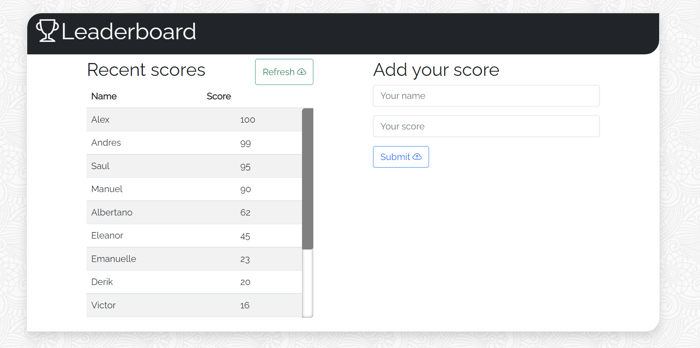

# Project: Leaderboard

> This project is a leaderboard, with names and scores, that consumes an API, preserving the data, with POST and GET calls.

 

Additional description about the project and its features.

## Built With

- HTML
- CSS
- Bootstrap
- Javascript

## Live Demo

[Live Demo Link](https://livedemo.com)

## Getting Started

**This is an example of how you may give instructions on setting up your project locally.**

To get a local copy up and running follow these simple example steps.

### Prerequisites
- npm installed
- VSCode

### Setup
- git clone https://github.com/Wikitelmex/CRUDClass-webpack-linters-jest
  
### Install
- `npm install`
- `npm install --dev` (to install the dev dependencies, like webpack)

### Usage

### Run tests

### Deployment

## Authors

👤 **Alex Castillo**

- GitHub: [@githubhandle](https://github.com/Wikitelmex)
- Twitter: [@twitterhandle](https://twitter.com/Alejand84515448)
- LinkedIn: [LinkedIn](https://www.linkedin.com/in/alejandro-castillo-6849131a9/)

## 🤝 Contributing

Contributions, issues, and feature requests are welcome!

Feel free to check the [issues page](../../issues/).

## Show your support

Give a ⭐️ if you like this project!

## Acknowledgments

- Hat tip to anyone whose code was used
- Inspiration
- etc

## 📝 License

This project is [MIT](./MIT.md) licensed.
